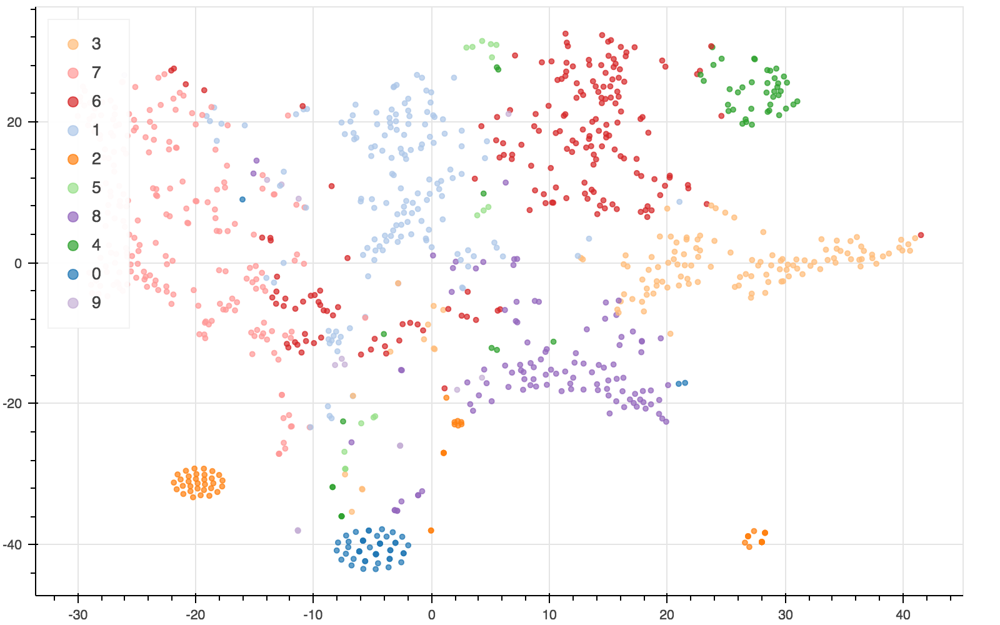

# Topic modeling


## Datails
Twitter data를 이용해 토픽모델링(NMF; Nonnegative Matrix Factorization) 및  
시각화(Bokeh line graph, Wordcloud)를 하는 예제입니다.


## Data
* 랜섬웨어 관련 Twitter data  
  https://goo.gl/t3ByxG


## Dependency

* Anaconda Python 3.6
* pip install stop-words
* pip install bokeh
* pip install wordcloud


* nltk는 기본적으로 anaconda package로 설치되어있습니다만 WordNet을 설치해야합니다.  
  terminal에서 python 실행후  
	
  ```
  import nltk
  nltk.download()
  ```
  코드를 입력해서 download manager를 실행한 후, wordnet을 선택해서 설치합니다.


## 실행순서
1. preprocess_twit.ipynb
2. topic_modeling_twit.ipynb
3. topicmodeling_time.ipynb


## Output
### t-SNE 


### Bokeh time series graph


### Wordcloud 

