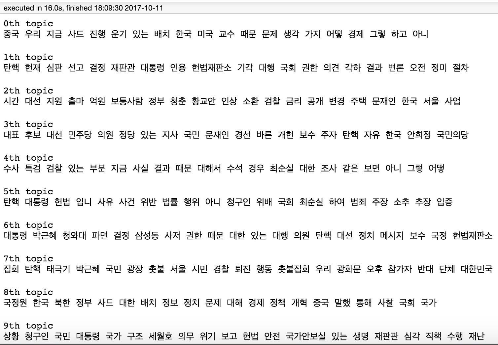
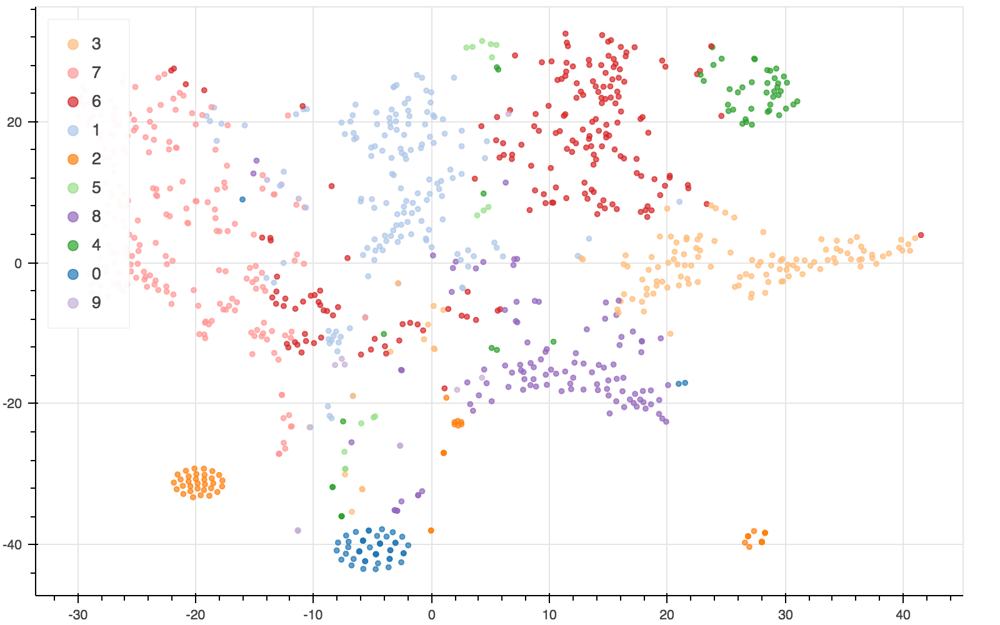

# Topic modeling

## Datails
뉴스 기사를 이용해 데이터 처리(크롤링 및 전처리), 토픽모델링(NMF; Nonnegative Matrix Factorization) 및 시각화(Bokeh line graph, Wordcloud)를 하는 예제입니다.

## Data
* Naver news data (2017년 03월, 정치 관련)

## Dependency

* Anaconda Python 3.6
* pip install newspaper3k
* pip install konlpy
* pip install bokeh

## Output
### Topic Keywords

### t-SNE

